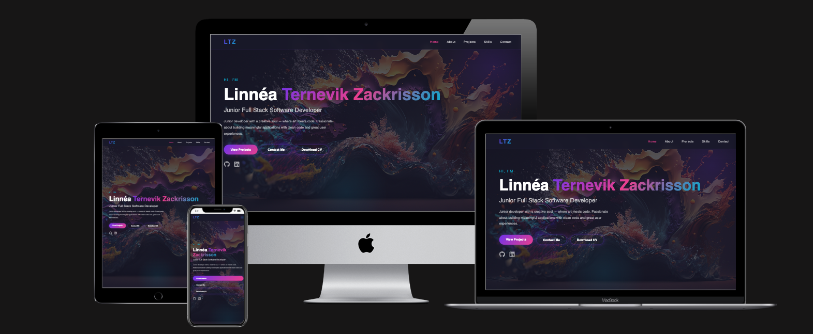

# 🎨 My Portfolio 


## 🚀 Live Demo
[linnea-tz-portfolio.vercel.app](https://linnea-tz-portfolio.vercel.app)

## 🛠️ Built With
- React & JavaScript
- CSS Modules
- Framer Motion
- EmailJS
- GitHub API

## ✨ Features
- Responsive design for mobile and desktop
- Project carousel with live GitHub API integration
- Animated skills ticker
- Contact form with EmailJS
- CV download
- Scroll snap navigation
- MVVM architecture

## 🔧 Setup & Installation
```bash
cd frontend
npm install
npm start
```

## Environment Variables
Create a `.env` file in `frontend/`:
```
REACT_APP_EMAILJS_SERVICE_ID=your_service_id
REACT_APP_EMAILJS_TEMPLATE_ID=your_template_id
REACT_APP_EMAILJS_PUBLIC_KEY=your_public_key
```

## 📁 Project Structure
```
frontend/src/
├── components/     # React components (Views)
├── hooks/          # Custom hooks (ViewModels)
├── constants/      # Navigation and skills data
└── styles/         # Global shared styles
```

## Deployment
Deployed on [Vercel](https://vercel.com)
